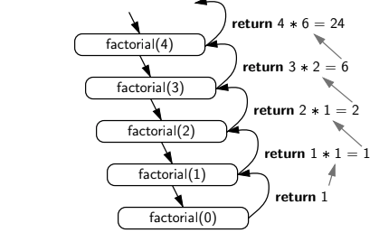
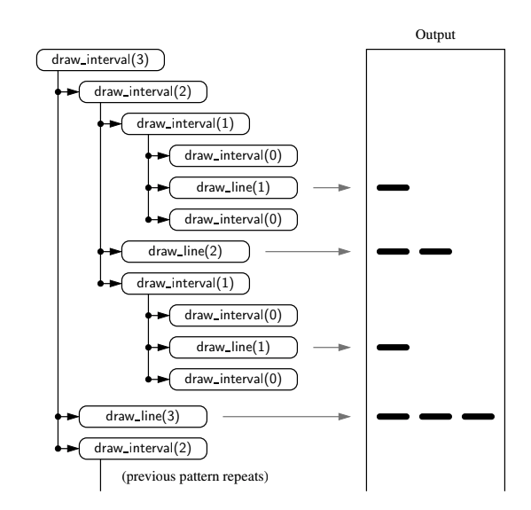
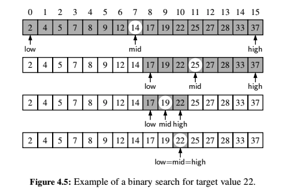
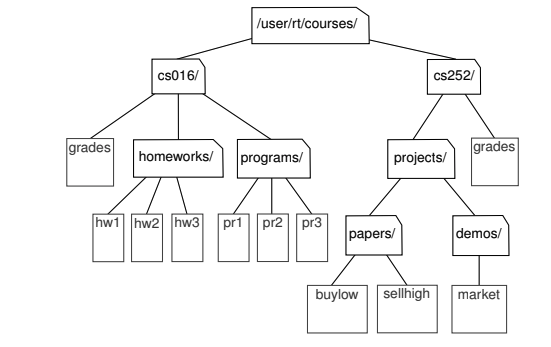
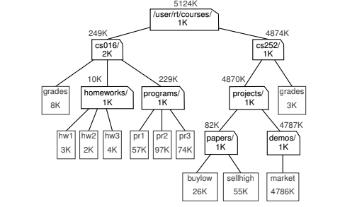
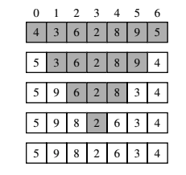

# Recursion

Recursion is a technique by which a funciton makes one or more calls to itself during execution, or by which a data structure relies upon smaller instances of the very same type of sturcture in its representation.

## 1. Factorial Function

[Python example](./factorial/factorial.py)



## 2. English Ruler

[Python example](./ruler-drawing/ruler-drawing.py)



## 3. Binary Search

[Python example](./binary-search/binary-search.py)



## 4. File System

[Python example](./file-system/fs.png)



### Compute used disk space



```py
DiskUsage(path):
  total = size(path)
  if path represents a directory then
    for each child entry stored within directory path do
      total = total + DiskUsage(child)
  return total
```

## 5. Fibonacci

[Python example](./fibonacci/fibonacci.py)

There's a temptation of using bad recursion formulation because of the way the nth Fibonacci number, $F_n$, depends on the two previous values $F_{n-2}$ and $F+{n-1}$. But notice that after computing $F_{n-2}$, the call to compute $F_{n-1}$ requires its own recursive call to compute $F_{n-2}$, as it does not have knowledge of the value of $F_{n-2}$ that was computed at the earlier level of recursion. That is __Binary Recursion__ that produces duplicative work, a snowballing effect that leads to the exponential running time of bad recursion. But we can create a __Linear Recursion__ algorithm.

## 6. Reverse a Sequence

[Python example](./reverse/reverse.py)


